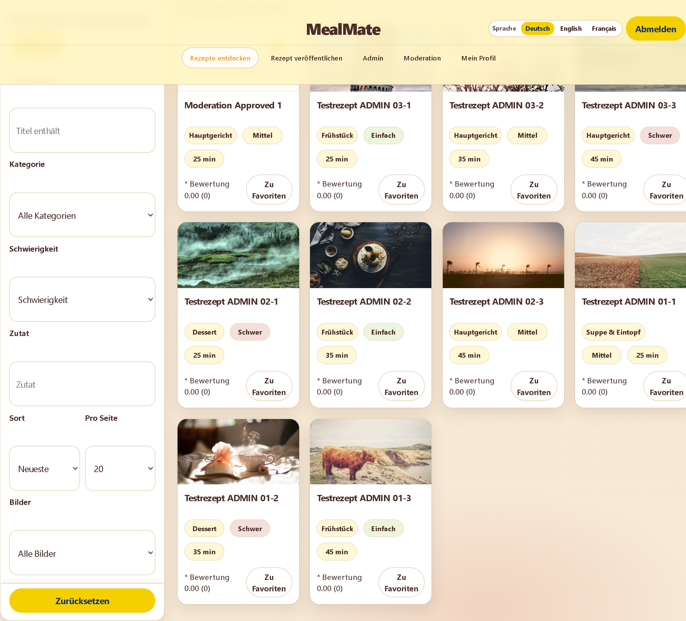
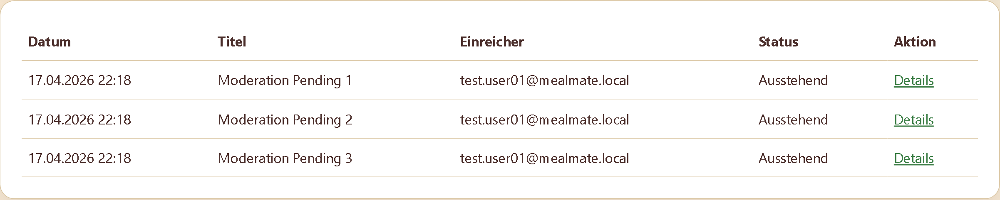

# MealMate

MealMate is a FastAPI application for recipe management with a server-rendered UI (Jinja2 + HTMX), moderation workflows, and translation support.




**Release:** `v1.0.0`  
**Status:** Production-ready baseline (self-hosted)

**Demo:** No public hosted instance is provided. The application is intended to run locally using the Quickstart instructions below.

## Features
- JWT cookie-based authentication with CSRF protection
- Recipe CRUD, favorites, ratings, and PDF export
- Moderation workflow for recipe submissions and image change requests
- CSV-based recipe import
- Translation workflow for `de`, `en`, and `fr`

## Tech Stack
- Python 3.12
- FastAPI, SQLAlchemy 2, Alembic
- Jinja2, HTMX
- SQLite (local development), PostgreSQL (deployment)
- Pytest, optional Playwright browser E2E
- Docker, Docker Compose

## Quickstart
### Windows
```bash
py -3.12 -m venv .venv
.venv\Scripts\activate
python -m pip install --upgrade pip
pip install -r requirements.txt
copy .env.example .env
python -m alembic -c alembic.ini upgrade head
python scripts/seed_admin.py
python -m uvicorn app.main:app --reload
```

### macOS / Linux
```bash
python3.12 -m venv .venv
source .venv/bin/activate
python -m pip install --upgrade pip
pip install -r requirements.txt
cp .env.example .env
python -m alembic -c alembic.ini upgrade head
python scripts/seed_admin.py
python -m uvicorn app.main:app --reload
```

## Access
- Application: `http://localhost:8000`
- Health endpoint: `http://localhost:8000/healthz`
- Default admin credentials (after running `scripts/seed_admin.py`):
  - Email: `admin@mealmate.local`
  - Password: `AdminPass123!`

## Configuration
Copy `.env.example` to `.env` and review at least:
- `APP_ENV`
- `DATABASE_URL`
- `SECRET_KEY`
- `ALLOWED_HOSTS`
- `KOCHWIKI_CSV_PATH` (default: `data/seed/rezepte_kochwiki_clean_3713.csv`)
- `COOKIE_SECURE` and `FORCE_HTTPS` for production
- `PORT`, `WEB_CONCURRENCY`, `WEB_TIMEOUT` for runtime behavior

## Quality Gates
```bash
python -m compileall app tests
pytest -q
pytest -q -W error
```

Playwright note:
- Browser E2E tests are skipped automatically if browser binaries are not installed.
- Install browser binaries locally with:
```bash
python -m playwright install chromium
```

## Deployment
- Local container run:
```bash
docker compose up --build
```
- Deployment guide: `docs/deployment/DEPLOYMENT.md`
- Security checklist: `docs/deployment/SECURITY.md`
- Operability guide: `docs/development/OPERABILITY.md`

## Documentation
- Documentation index: `docs/README.md`
- Setup guide: `docs/development/SETUP.md`
- Testing guide: `docs/development/TESTING.md`
- Release process: `docs/development/RELEASE.md`
- Release checklist: `docs/development/RELEASE_CHECKLIST.md`
- Changelog: `CHANGELOG.md`
- Contributing: `CONTRIBUTING.md`
- Internal docs boundary: `docs/internal/README.md`

## Repository Structure
```text
app/            application code (routers, services, templates, static)
alembic/        database migrations
tests/          test suite (unit/integration/e2e)
scripts/        developer and operator scripts
tools/          diagnostics and maintenance tools
docs/           public and internal documentation
data/seed/      local seed and import data
```

## Known Limitations
- SQLite is for local development only; production requires PostgreSQL.
- Playwright browser tests require local browser binaries and are otherwise skipped.
